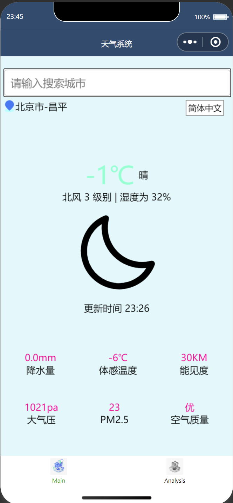

# 天气系统

+ 为了完成数据库课设，我居然写了一个小程序，hahahaha（作者发疯，无需理会）
+ 这里附上小程序前端的源码和python后端源码
+ 使用了和风天气api，支持正版，从我做起

## 功能实现

### 界面一

1. 可以获取当前定位的地点
2. 可以实现刷新功能和定时刷新功能
3. 可以搜索想要查询的城市的天气
4. 支持多语言实现
5. 实时展示所选城市的天气指标
6. 点击定位按钮可以回到当前所在位置的城市

### 界面二

1. 默认获取当前位置的地点
2. 可以搜索想要查询的城市名称
3. 连接python后端，返回未来的天气情况
4. 有未来七天的天气，也有未来24小时的天气
5. 未来24小时的界面可以横向滑动

## 功能展示

这里放一些实际演示的图片，在iPhone12上演示：

  
  
  
  
  
  

---

本项目只用于学习，不用于商用，出现任何问题概不负责。

祝您学的开心！

If you think it will help you, you can treat me to a cup of milk tea, thank you very much.

如果你认为对你有帮助，并且帮到了你，你可以请我喝一杯咖啡，谢谢。

